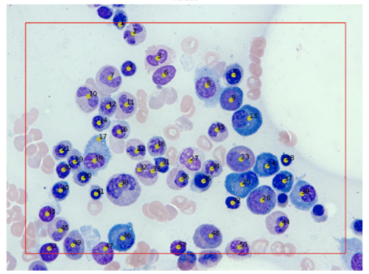

# Cell Detector

## Background and Overview
Cell Detector is a graphical user interface written in Python that automatically detects cells in microscopy images and outputs cropped subimages.
The OpenCV library was used to research and implement image processing algorithms to output the best detection yield.
The PyQt library was used to design the user interface to allow easier and faster usage of the completed application.

